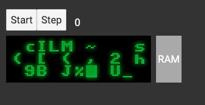

# Bernadette - A retro computing exploration in software

This was a project I used to explore the different ideas of retro-computing hardware and recreating a simple "8-bit computer" in software, including: memory allocation, signal-passing, screen memory and rendering a display pixel-by-pixel, program counters and machine code execution. I also had some fun trying to re-create the look of an old CRT monitor.

I originally started this application in Dart, but switched to Svelte to better handle updating a lot of divs in the DOM. (The screen has one div for each pixel.)

Demo: http://rscottfree.github.io/bernadette/



## Running
```
clone the repo
cd svelte/
npm install
npm run dev
go to http://localhost:5000
```